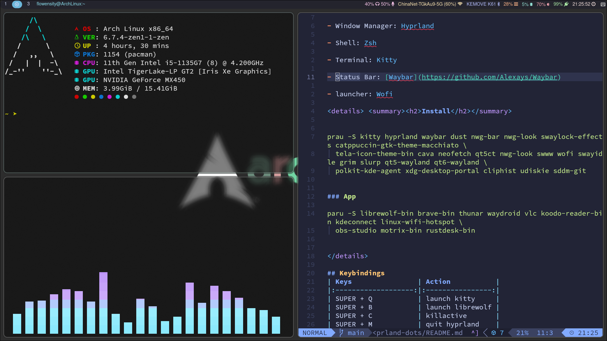

<div>
    <H1>Flowenisty's Hyprland dotfiles <H1> 
</div>

- Window Manager: [Hyprland](https://github.com/hyprwm/Hyprland)

- Shell: [Zsh](https://www.zsh.org/)

- Terminal: [Kitty](https://sw.kovidgoyal.net/kitty/)

- Status Bar: [Waybar](https://github.com/Alexays/Waybar)

- launcher: [Tofi](https://github.com/philj56/tofi)

## Preview
 
## Install
### Dependencies
```bash
prau -S kitty hyprland waybar mako nwg-bar nwg-look hypridle hyprlock \
  cava neofetch qt6ct swww tofi grim slurp qt5-wayland qt6-wayland \
  polkit-kde-agent xdg-desktop-portal clipse udiskie sddm

```
### Themes and Fonts
```bash
  paru -S catppuccin-gtk-theme-macchiato tela-icon-theme-bin ttf-monaspace-variable ttf-font-awesome
```
### Apps
```bash
paru -S librewolf-bin brave-bin waydroid mpv koodo-reader-bin kdeconnect \
  linux-wifi-hotspot obs-studio motrix-bin rustdesk-bin
```

## Keybindings
| Keys                | Action           |
|:-------------------:|:----------------:|
| SUPER + Return      | launch kitty     |
| SUPER + B           | launch librewolf |
| SUPER + Q           | killactive       |
| SUPER + M           | quit hyprland    |
| SUPER + F           | togglefloating   |
| SUPER + R           | launch tofi      |
| SUPER + SHIFT + F   | fullscreen       |
| SUPER + [HJKL]      | movefocus        |
| SUPER + [1-9]         | toggle workspace |
| SUPER + SHIFT + [1-9] | movetoworkspace  |
| SUPER + mouse:272   | movewindow       |
| SUPER + mouse:273   | resizewindow     |
| SUPER +ESCAPE       | launch nwg-bar   |
| SUPER + SHIFT + S   | screenshot       |
| SUPER + SHIFT + L   | launch swaylock  |
| SUPER + V           | clipboard        |
| SUPER + SHIFT + W   | chang wallpaper  |

